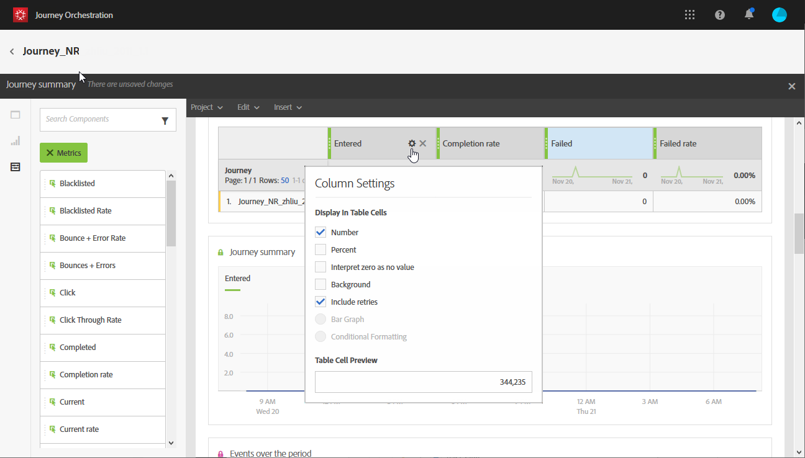
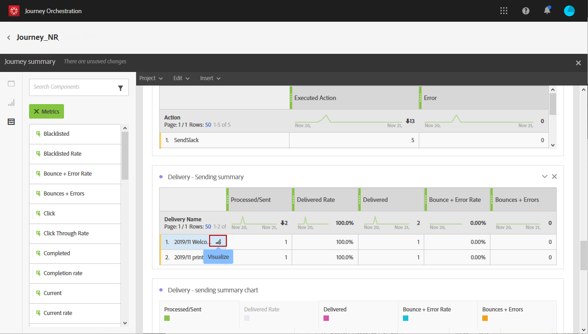
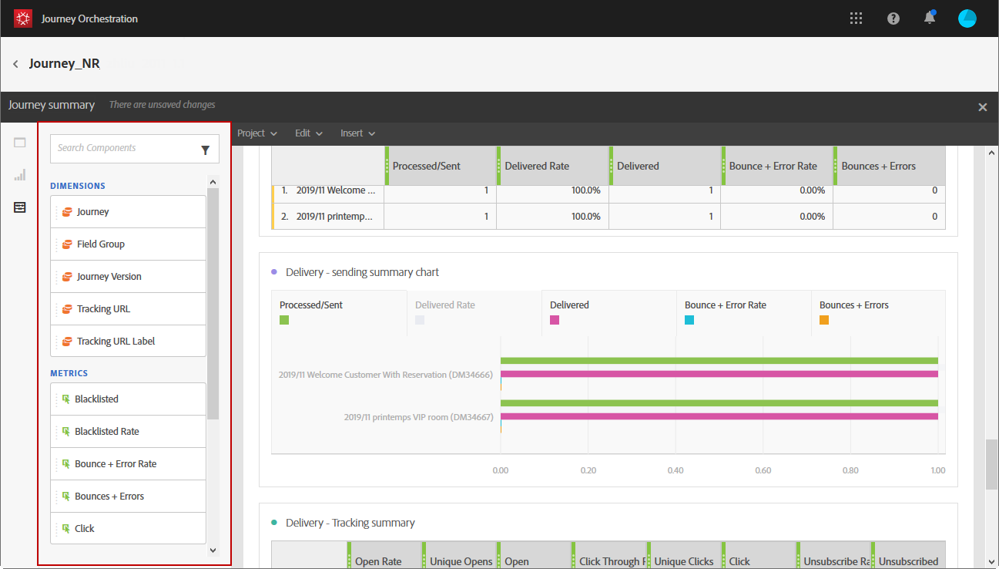
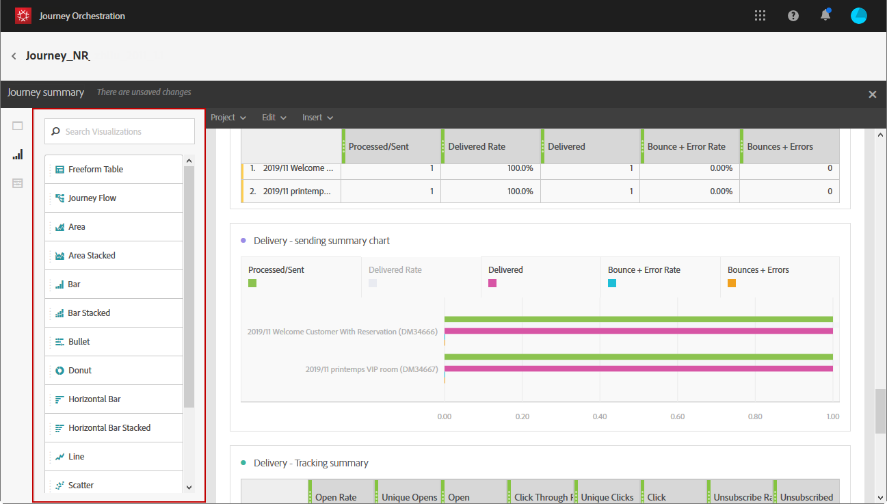

# Creating your journey reports {#concept_rfj_wpt_52b}

## Accessing and creating your reports {#accessing-reports}

This section will present you how to create or use out-of-the-box reports. Combine panels, components and visualizations to better track the success of your journeys.

To access your journeys' reports and start tracking the success of your deliveries:

1. In the top menu, click the **[!UICONTROL Home]** tab.

1. Select the journey you want to report on.

   Note that you can also access your reports by clicking **Report** while hovering over a journey in the list of journeys.

    

1. Click the **[!UICONTROL Report]** icon at the top right of your screen.

    

1. The **[!UICONTROL Journey summary]** out-of-the box report appears on screen. To access custom reports, click the **[!UICONTROL Close]** button.

    

1. Click the **[!UICONTROL Create new project]** to create your report from scratch.

    

1. From the **[!UICONTROL Panels]** tab, drag and drop as many panels or freeform tables as needed. For more information, refer to this [section](#adding-panels).

    

1. You can then start filtering your data by drag and dropping dimensions and metrics from the **[!UICONTROL Components]** tab to your freeform table. For more information, refer to this [section](#adding-components).

    

1. To have a clearer view of your data, you can add visualizations from the **[!UICONTROL Visualizations]** tab. For more information, refer to this [section](#adding-visualizations).

## Adding panels{#adding-panels}

### Adding a blank panel {#adding-a-blank-panel}

To start your report, you can add a set of panels to an out-of-the-box or custom report. Each panel contains different data sets and is composed of freeform tables and visualizations.

This panel allows you to build your reports as needed. You can add as many panels as you want in your reports in order to filter your data with different time periods.

1. Click the **[!UICONTROL Panels]** icon. You can also add a panel by clicking the **[!UICONTROL Insert tab]** and selecting **[!UICONTROL New Blank Panel]**.

   

1. Drag and drop the **[!UICONTROL Blank Panel]** into your dashboard.

   

You can now add a freeform table to your panel to start targeting data.

### Adding a freeform table {#adding-a-freeform-table}

Freeform tables allow you to create a table to analyze your data using the different metrics and dimensions available in the **[!UICONTROL Component]** table.

Each table and visualization is resizable and can be moved to better customize your report.

1. Click the **[!UICONTROL Panels]** icon.

   

1. Drag and drop the **[!UICONTROL Freeform]** item into your dashboard.

   You can also add a table by clicking the **[!UICONTROL Insert]** tab and selecting **[!UICONTROL New Freeform]** or by clicking **[!UICONTROL Add a freeform table]** in an empty panel. 

   

1. Drag and drop items from the **[!UICONTROL Components]** tab into the columns and rows to build your table.

   

1. Click the **[!UICONTROL Settings]** icon to change how the data is displayed in your columns.

   

   The **[!UICONTROL Column settings]** is composed of:

    * **[!UICONTROL Number]**: lets you show or hide summary numbers in the column.
    * **[!UICONTROL Percent]**: lets you show or hide percents in the column.
    * **[!UICONTROL Interpret zero as no value]**: lets you show or hide when value equals zero.
    * **[!UICONTROL Background]**: lets you show or hide the horizontal progress bar in cells.
    * **[!UICONTROL Include retries]**: lets you include retries in the result. This is only available for **[!UICONTROL Sent]** and **[!UICONTROL Bounces + Errors]**.

1. Select one or multiple rows and click the **[!UICONTROL Visualize]** icon. A visualization is added to reflect the rows you have selected.

   

You can now add as many components as you need and also add visualizations to give graphical representations of your data.

## Adding components{#adding-components}

Components help you customize your reports with different dimensions, metrics, and time periods.

1. Click the **[!UICONTROL Components]** tab to access the list of components.

   

1. Each category presented in the **[!UICONTROL Components]** tab displays the five most used items, click the name of a category to access its full list of components.

   The components table is divided into three categories:

    * **[!UICONTROL Dimensions]**: Get details from the deliveries log, such as the recipient's browser or domain, or the success of a delivery.
    * **[!UICONTROL Metrics]**: Get details on the status of a message. For example, if a message was delivered and the user opened it.
    * **[!UICONTROL Time]**: Set a time period for your table.

1. Drag and drop components in a panel to start filtering your data.

You can drag and drop as many components as needed and compare them to one another.

## Adding visualizations{#adding-visualizations}

The **[!UICONTROL Visualizations]** tab lets you drag and drop visualization items, such as area, donut and graph. Visualizations give you graphical representations of your data.

1. In the **[!UICONTROL Visualizations]** tab, drag and drop a visualization item in a panel.

   

1. After adding a visualization to your panel, your reports will automatically detect the data in your freeform table. Select the settings for your visualization.
1. If you have more than one freeform table, choose the available data source to add in your graph in the **[!UICONTROL Data Source Settings]** window. This window is also available by clicking on the colored dot next to your visualization title.

   

1. Click the **[!UICONTROL Visualization]** settings button to directly change the graph type or what is displayed on it, such as:

    * **[!UICONTROL Percentages]**: Displays the values in percentage. 
    * **[!UICONTROL Anchor Y Axis at Zero]**: Forces the y axis to zero even if values range above zero. 
    * **[!UICONTROL Legend visible]**: Lets you hide the legend.
    * **[!UICONTROL Normalization]**: Forces values to match.
    * **[!UICONTROL Display Dual Axis]**: Adds another axis to your graph.
    * **[!UICONTROL Limit Max Items]**: Limits the number of graphs displayed.
    * **[!UICONTROL Threshold]**: Lets you set a threshold to your graph. It appears as a black dotted line.

   

This visualization allows you to have a clearer view of your data in your reports.