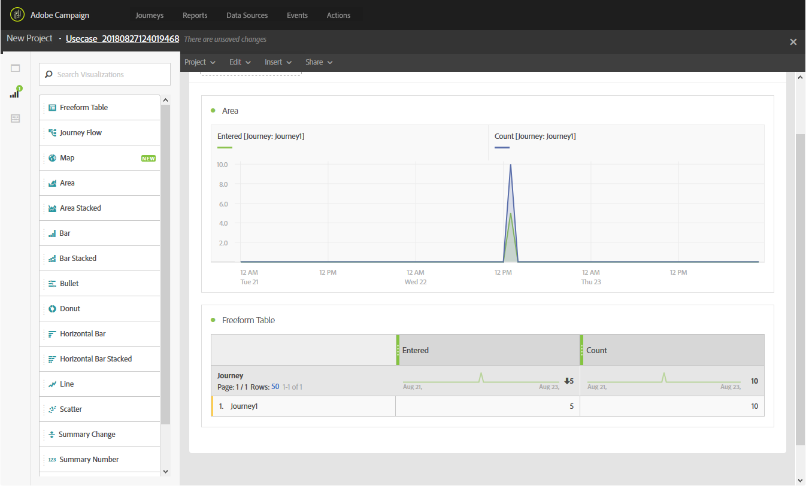

# Creating your Journeys reports{#concept_rfj_wpt_52b}

This section will present you how to create or use out-of-the-box reports. Combine panels, components and visualizations to better track the success of your journeys.

1. To create a custom report on your journeys, you first need to access the reports by clicking the **Reports** tab if you want to target every created journey. You can also access the reports to a specific journey from your journey's summary page.

1. Click the **Create new project** if you want to create your report from scratch. 

1. From the **Panels** tab, drag and drop as many panels or freeform tables as needed. 

1. You can then start filtering your data by drag and dropping dimensions and metrics from the **Components** tab to your freeform table. 

1. To have a clearer view of your data, you can add visualizations from the **Visualizations** tab. 

1. If you are building your report on one journey, you can simply go back to your journey by clicking your journey's name in your report's title.

Each table cell and visualization can be configured. For more on this, refer to the [Adobe Campaign Standard documentation](https://helpx.adobe.com/campaign/standard/reporting/using/adding-panels.html).

Your reports can also be saved, shared or downloaded. For more on this, refer to the [Adobe Campaign Standard documentation](https://helpx.adobe.com/campaign/standard/reporting/using/reporting-interface.html#toolbar).
    