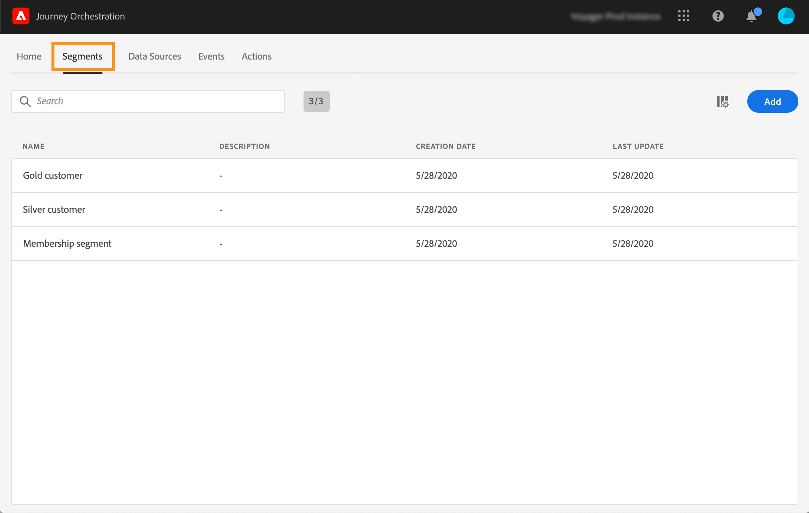
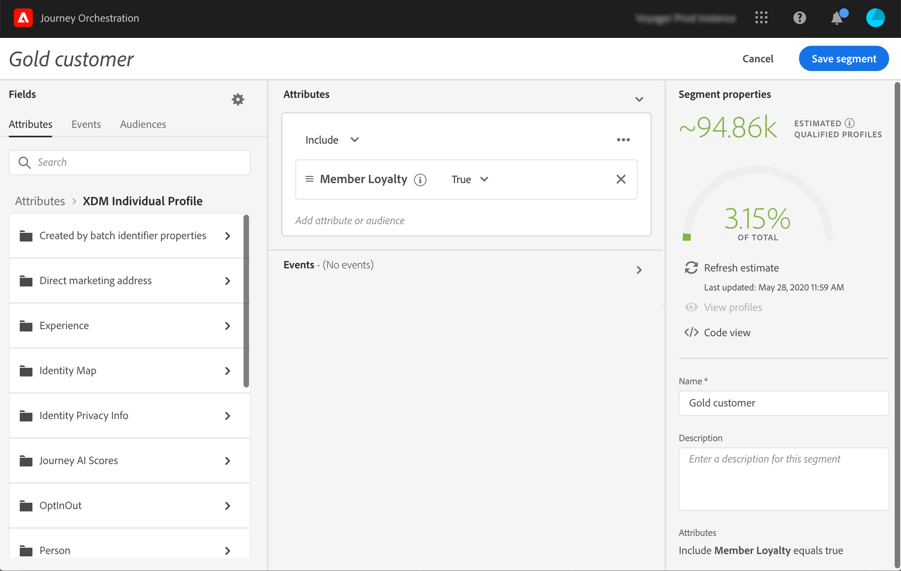

# Creating a segment {#creating-a-segment}

You can either create a segment using the [Platform Segmentation Service](https://docs.adobe.com/content/help/en/experience-platform/segmentation/home.html) or you can access and create them directly in [!DNL Journey Orchestration].

1. In the top menu, click on the **[!UICONTROL Segments]** tab. The list of Platform segments is displayed. You can search for a specific segment in the list.

 

1. Click **[!UICONTROL Add]** to create a new segment. The segment definition screen allows you to configure all the required fields to define your segment. The configuration is the same as in the Segmentation Service. Refer to the [Segment Builder user guide](https://docs.adobe.com/content/help/en/experience-platform/segmentation/ui/overview.html).

 

Your segment can now be used in your journeys to build conditions or add a **Segment qualification** event. See [Using segments in conditions](../segment/using-a-segment.md) and [Events activities](../building-journeys/segment-qualification-events.md).