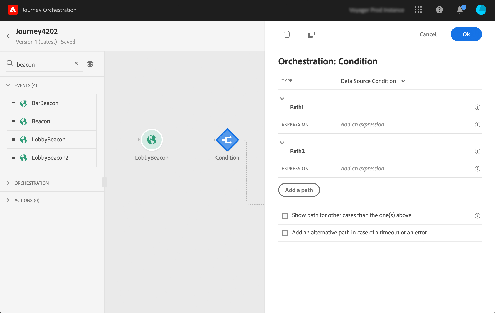
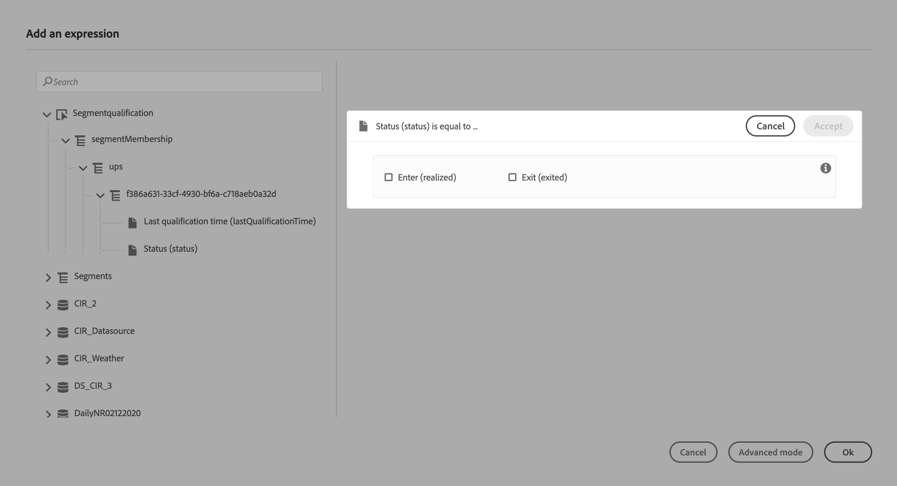
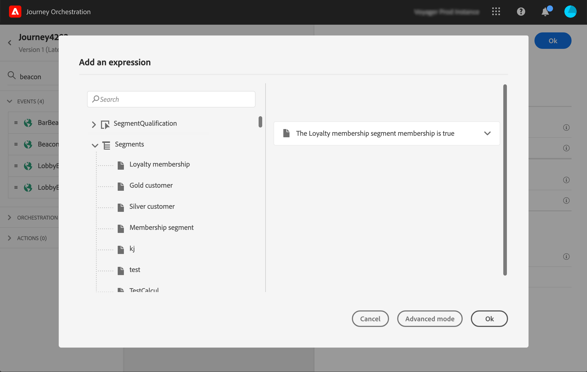

# Using segments in your journeys {#using-a-segment}

This section explains how to use a segment in a journey condition or action.
To learn how to use a **Segment qualification** event in your journey, refer to [Events activities](../building-journeys/event-activities.md#segment-qualification).

The following steps allow you to use a segment in a journey condition. For journey action mapping, the principle is similar.

1. Open a journey, drop a **Condition** activity and choose the **Data Source Condition**.
   

1. Click **Add a path** for each extra path needed. For each path, click the **Expression** field.

   

1. On the left side, unfold the **SegmentQualification** or **Segments** node. Drag and drop the segment you want to use for your condition. 

   From the **SegmentQualification** node, you can choose between the **Last qualification time** and the **status** (enter or exit).

   

   When you drop an element from the **Segments** node, the condition on the segment is true by default.

   

For more information on journey conditions and how to use the simple expression editor, refer to [Condition activities](../building-journeys/condition-activity.md#about_condition).
