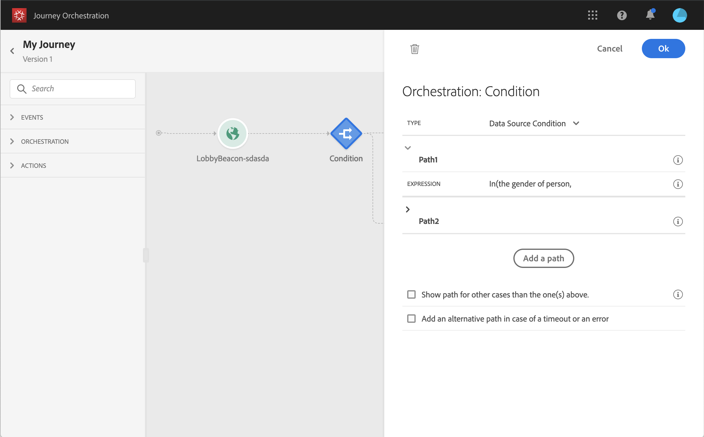

# Using segments in conditions {#using-a-segment}

This section explains how to use a segment in a journey condition.
To learn how to use a **Segment qualification** event in your journey, refer to [Events activities](../building-journeys/event-activities.md#segment-qualification).

To use a segment in a journey condition, follow these steps:

1. Open a journey, drop a **Condition** activity and choose the **Data Source Condition**.
  
1. Click **Add a path** for each extra path needed. For each path, click the **Expression** field.
  
1. On the left side, unfold the **Segments** node. Drag and drop the segment you want to use for your condition. By default, the condition on the segment is true.
  

For more information on journey conditions and how to use the simple expression editor, refer to [Condition activities](../building-journeys/condition-activity.md#about_condition).
