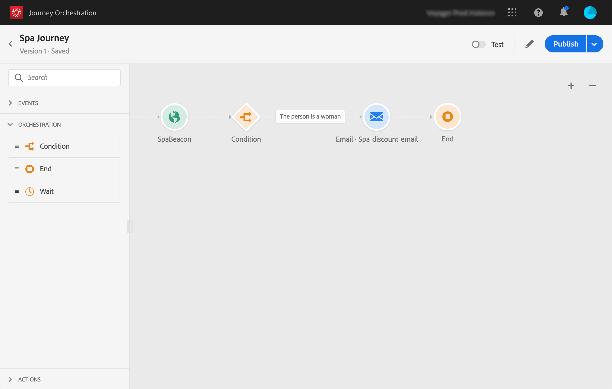

# Simple use case {#concept_grh_vby_w2b}

Let's take the example of a hotel brand named Marlton. In their hotels, they have positioned beacon devices near all the strategic areas: lobby, floors, restaurant, gym, pool, etc.

In this use case, we will see how to send a personalized message in real-time to a person walking next to a beacon positioned near the spa.

We want to send a message only if the person is a woman. The message must be received within seconds.

