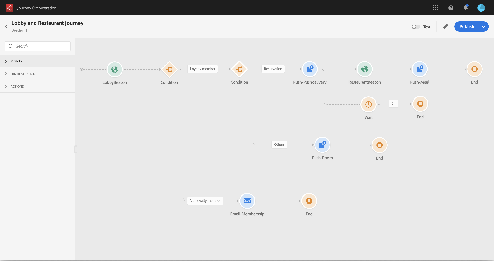

# Advanced use case {#concept_vzy_ncy_w2b}

Let's take the example of a hotel brand named Marlton. In their hotels, they have positioned beacon devices near all the strategic areas: lobby, floors, restaurant, gym, pool, etc.

In this use case, we will see how to send personalized messages in real-time to customers when they walk near a specific beacon.

First of all, we want to send a message as soon as a person enters a Marlton hotel. We want to send a message only if the person has not received any communication from us within the last 24 hours.

We then check two conditions:

* If this person is not a loyalty member, we send him an email to join the loyalty membership offer.
* If this person is already a loyalty member, we check if he has a room reservation:
    * If he doesn't, we send him a push notification with room rates.
    * If he does, we send him a welcome push notification. And if he enters the restaurant within the next 6 hours, we send him a push notification with a discount on a meal.

For this use case, we will need to create two events (see [creating events](uc2event.md):

* The lobby beacon event that will be pushed to the system when a customer enters the hotel.
* The restaurant beacon event that will be pushed when a customer enters the restaurant.

We will need to configure a connection to two data sources (see [data sources](uc2ds.md):

* The build-in Experience Platform data source, to retrieve the information for our two conditions (loyalty membership and last contact date) as well and the message personalization information.
* The hotel reservation system, to retrieve the reservation status information.
