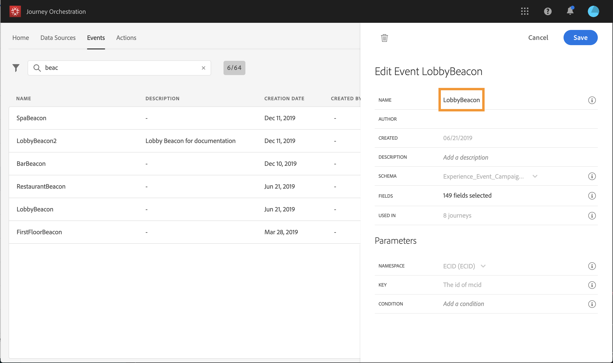
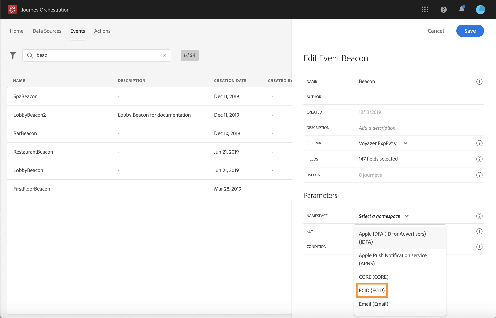
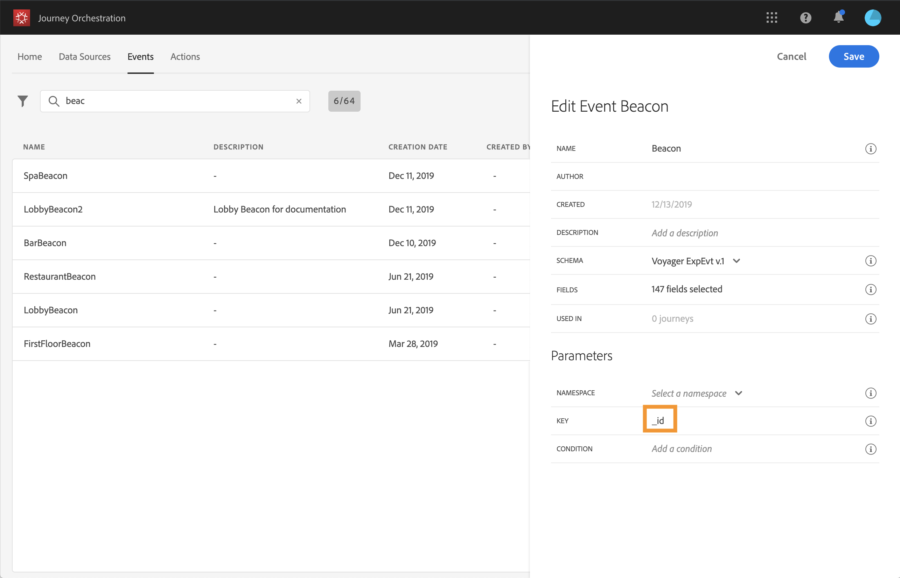
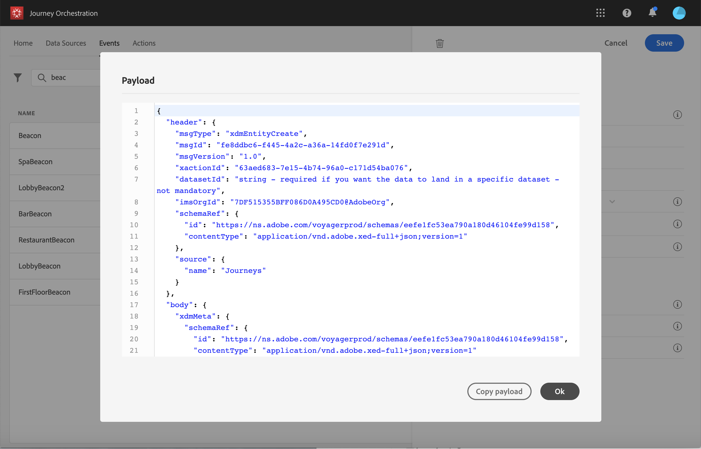

# Configuring the events{#concept_sbp_5cy_w2b}

In our scenario, we need to receive an event each time a person enters the Marlton hotel and the restaurant. The **technical user** needs to configure the two events we want the system to listen to in our journey.

For additional information on event configuration, refer to .

1. In the top menu, click the **Events** tab and click **Add** to create a new event.

    

1. We enter the name with no spaces or special characters: "LobbyBeacon".

    

 <!--li>Select the **Mobile - Streaming Ingestion APIs** event type. Events are sent from the customers' mobile phone through the Mobile SDK.. The system pushing the event should not generate an ID, it should use the one available in the payload preview. In our use case, this ID is used to identify the beacon location. Each time a person walks near the lobby beacon, an event will be sent containing this specific event ID. The same principle applies to the restaurant beacon events. This allows the system to know which beacon triggered the event sending.

    
 
    >[!NOTE]
    >
    >The list of fields varies from one schema to another. According to the schema definition, some fields may be mandatory and pre-selected.

1. We need to select a namespace. A namespace is preselected based on schema properties. You can keep the one preselected. For more information on namespaces, see .

    

1. A key is preselected based on schema properties and the namespace selected. You can keep it.

    

1. Click **Save**.

1. Click the **View payload** icon to preview the payload expected by the system and share it with to the person responsible for the event sending.  This payload will need to be configured in the postback of the Mobile Services administration console.

    

In the same way, create the "RestaurantBeacon" event. Your two beacon events are created and can now be used in our journey. You now need to configure the mobile application so that it can send the expected payload to the Streaming Ingestion APIs endpoint. See .
