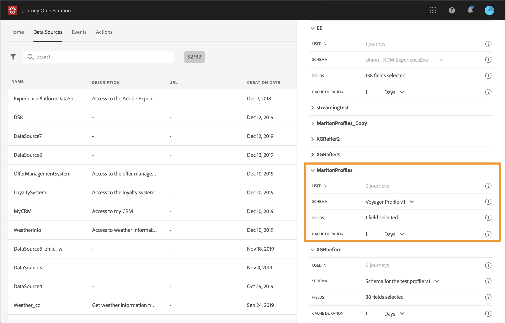
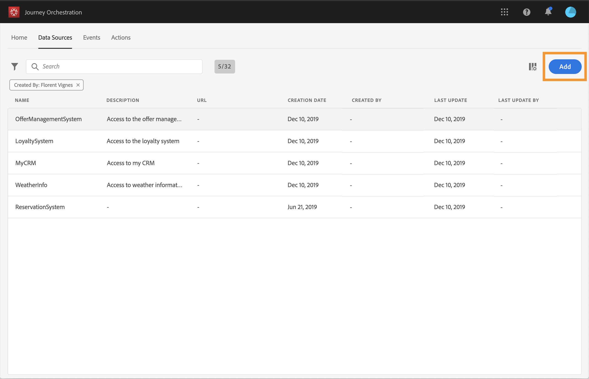

# Configuring the data sources {#concept_vml_hdy_w2b}

In our use case, we want to use personalization data for our messages. We also need to check if the person is a loyalty member and has not been contacted in the last 24 hours. This information is stored in the Real-time Customer Profile database. The **technical user** needs to configure the Adobe Experience Platform data source to retrieve those fields.

For additional information on data source configuration, refer to [](../datasource/about-data-sources.md).

1. In the top menu, click the **[!UICONTROL Data Sources]** tab and select the build-in Adobe Experience Platform data source.

    

1. In the pre-configured group fields, check that the following fields are selected:

    * _person > name > firstName_
    * _person > name > lastName_
    * _personalEmail > address_

1. Click **[!UICONTROL Add a New Field Group]**, select a **[!UICONTROL Profiles]** schema and add the **Loyalty member** field for our condition. The **Loyalty member** field is a custom field and was added in XDM: "_customer > marlton > loyaltyMember"

    

1. Click **[!UICONTROL Add a New Field Group]**, select an **[!UICONTROL ExperienceEvent]** schema and choose the fields needed for our condition on the number of messages sent in a given period: _timestamp_ for the date and _directMarketing > sends > value_ for the number of messages sent.

    

1. Click **[!UICONTROL Save]**.

We also need to check if the person has a reservation in the hotel reservation system. The **technical user** needs to configure a second data source to retrieve this field.

1. In the list of data sources, click **[!UICONTROL Add]** to add a new external data source to define the connection to your hotel reservation system.

    

1. Enter a name for your data source and the URL of the external service, for example: _https://marlton.com/reservation_

    >[!CAUTION]
    >
    >We strongly recommend using HTTPS for security reasons.

1. Configure the authentication depending on the external service configuration: **[!UICONTROL No authentication]**, **[!UICONTROL Basic]**, **[!UICONTROL Custom]** or **[!UICONTROL API key]**. In our example, we choose "Basic" for the type and specify the username and password for the API call.

    

1. Click **[!UICONTROL Add a New Field Group]** to define the information to be retrieved and the API parameters. For our example, there is only one parameter (the id), so we need to create one field group with the following information:

    * **[!UICONTROL Method]**: select the POST or GET method. In our case, we select the GET method.
    * **[!UICONTROL Cache duration]**: this varies according to the frequency of the API calls. In our case, the reservation system is updated every 10 minutes.
    * **[!UICONTROL Response Payload]**: click inside the **[!UICONTROL Payload]** field and paste an example of the payload. Verify that the field types are correct. Each time the API is called, the system will retrieve all the fields included in the payload example. In our example, the payload only contains the reservation status:

    ```
    {
        "reservation" : true
    }
    ```

    * **[!UICONTROL Dynamic Values]**: enter the parameter corresponding to the key used to identify each customer, "id" in our example. The value of this parameter will be defined in the journey.

    

1. Click **[!UICONTROL Save]**.

    The data sources are now configured and ready to be used in your journey.
