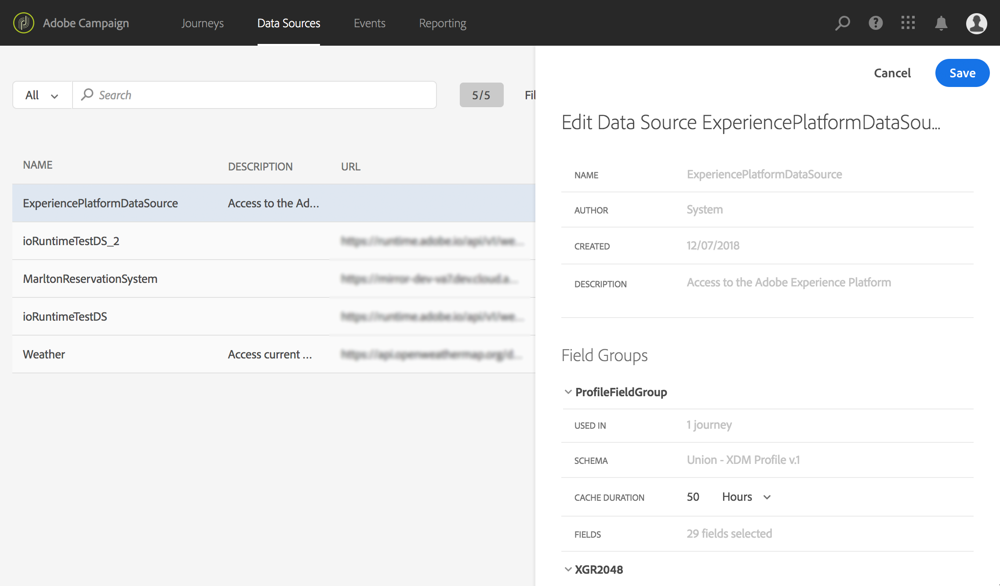
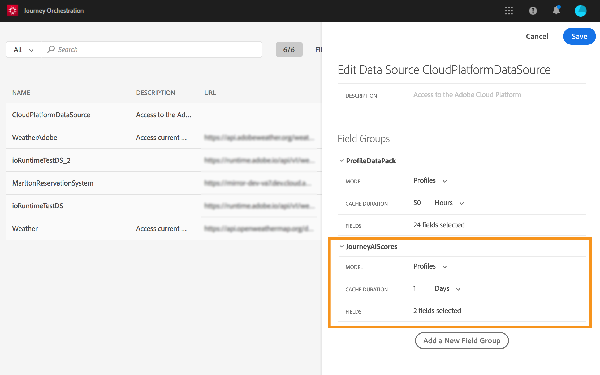
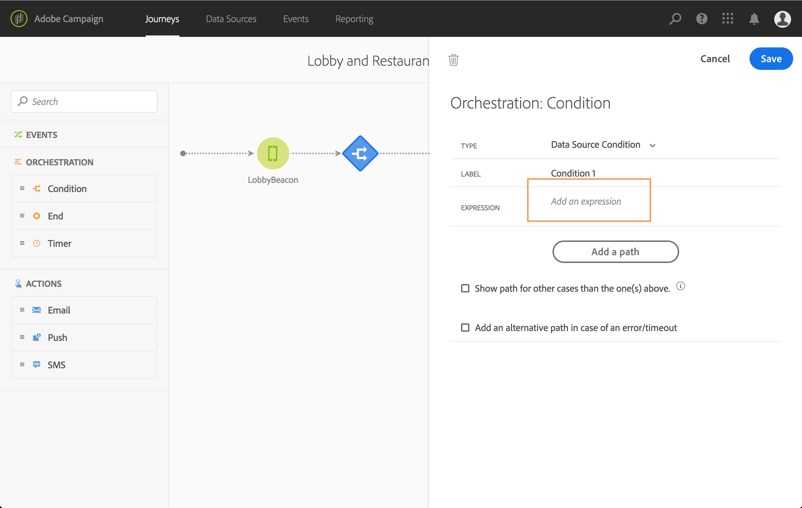
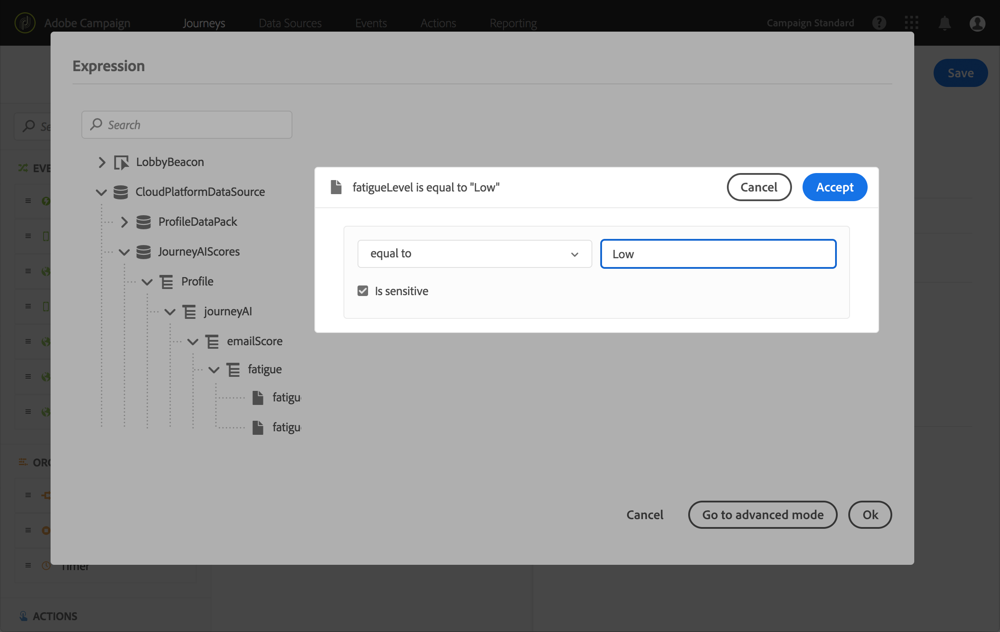
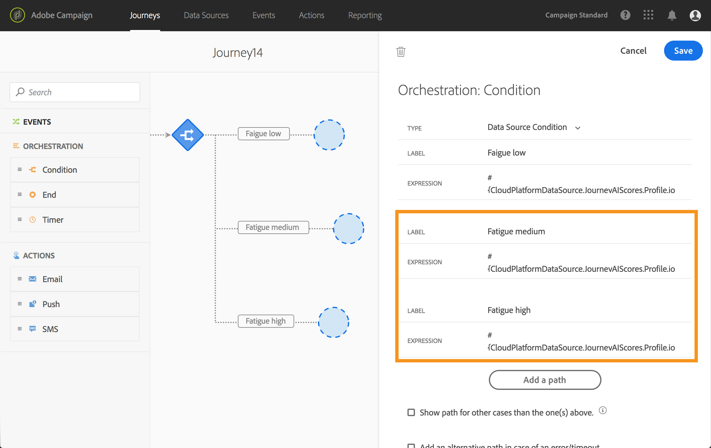
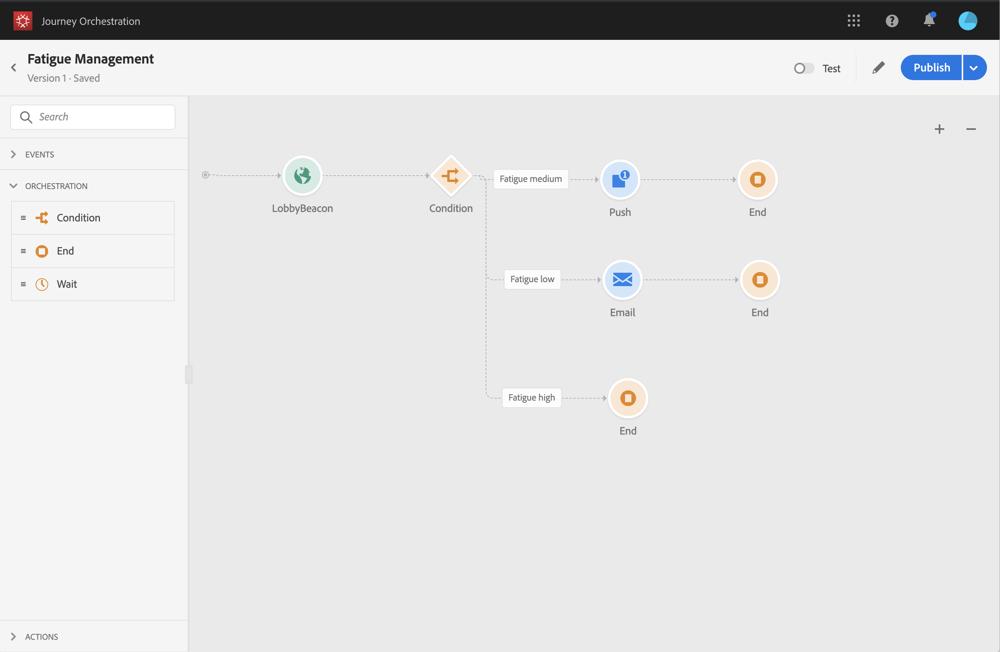

# Leveraging Journey AI {#concept_dsh_1ry_wfb}

This use case will show you how to leverage fatigue scores to avoid over-soliciting your customers in your journeys.

>[!NOTE]
>
>The predictive fatigue score capability is only available to customers who use the Adobe Campaign Standard Data Service feature.

## Configuring the event {#section_ptb_ws1_ffb}

Follow the steps described in [](../event/about-events.md).

## Configuring the data source {#section_o3n_4yy_wfb}

Perform the following steps to select the fatigue score fields in the built-in data source:

1. In the top menu, click the **[!UICONTROL Data Sources]** tab and select the build-in Experience Platform data source.

    

1. Check that the fields required for your use case are selected.
1. Click **[!UICONTROL Add a New Field Group]**, select the **[!UICONTROL Profiles]** model and add the **[!UICONTROL fatigueLevel]** and **[!UICONTROL fatigueScore]** fields (under _journeyAI > emailScore > fatigue_).

    

1. Click **[!UICONTROL Save]**.

## Building the journey {#section_uzm_pyy_wfb}

To create, validate and publish the journey, follow the steps described in [](../building-journeys/journey.md).

In our use case, we're leveraging the **[!UICONTROL fatigueLevel]** field. You can also use the **[!UICONTROL fatigueScore]** field.

Perform the following steps to leverage the fatigue level in your journey:

1. Add an event and a condition in your journey.

    

1. Choose the **[!UICONTROL Data Source Condition]** type and click in the **[!UICONTROL Expression]** field.

    

1. Using the simple expression editor, look for the **[!UICONTROL fatigueLevel]** field (_ExperiencePlatformDataSource > JourneyAIScores > Profile > journeyAI > emailScore > fatigue_), drop it to the right and create the following condition: "fatigueLevel is equal to "Low". Click **[!UICONTROL Ok]**.

    

    The advanced expression is: 

    ```
    #{ExperiencePlatformDataSource.JourneyAIScores.Profile.journeyAI.emailScore.fatigue.fatigueLevel} == "low"
    ```

1. In the condition, create two other paths for medium and high fatigue levels.

    

1. You can now add different actions for each fatigue level.

    
