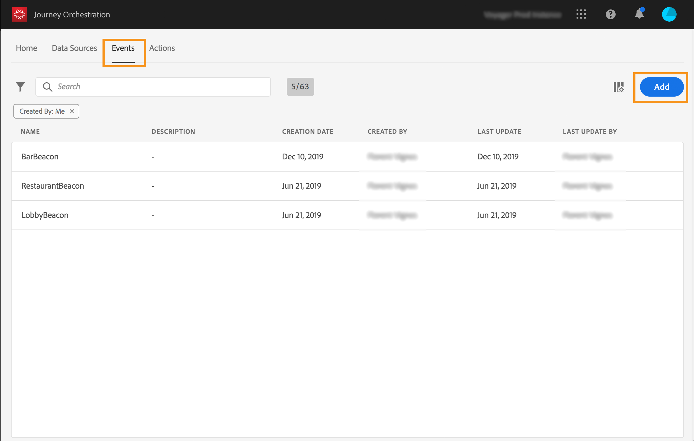
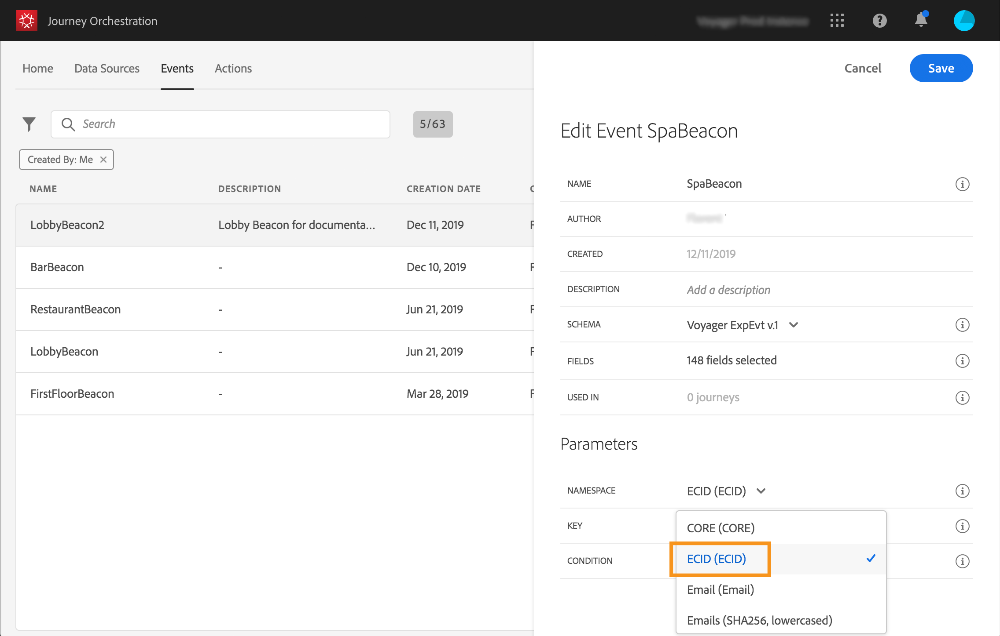

# Configuring the event {#concept_y44_hcy_w2b}

In our scenario, we need to receive an event each time a person walks near a beacon positioned next to the spa. The **technical user** needs to configure the event the system will listen to in our journey.

For additional information on event configuration, refer to [Configuring an event](../event/event.md#concept_gfj_fqt_52b).

1. In the top menu, click the **Events** tab and click **Add** to create a new event.

    

1. We enter the name without spaces or special characters: "SpaBeacon".

    

    <!--li>Select the **Mobile - Streaming Ingestion APIs** event type. Events are sent from the customers' mobile phone through the Mobile SDK.. The system pushing the event should not generate an ID, it should use the one available in the payload preview. In our use case, this ID is used to identify the beacon location. Each time a person walks near the spa beacon, an event will be sent containing this specific event ID. This allows the system to know which beacon triggered the event sending.

    

    >[!NOTE]
    >
    >The list of fields varies from one schema to another. According to the schema definition, some fields may be mandatory and pre-selected.

1. We need to select a namespace. A namespace is preselected based on schema properties. You can keep the one preselected. For more information on namespaces, see [Selecting the namespace](../event/eventnamespace.md#concept_ckb_3qt_52b).

    

1. A key is preselected based on schema properties and the namespace selected. You can keep it.

    

1. Click **Save**.

1. Click the **View payload** icon to preview the payload expected by the system and share it with to the person responsible for the event sending. This payload will need to be configured in the postback of the Mobile Services administration console. 

    

    The event is ready to be used in your journey. You now need to configure the mobile application so that it can send the expected payload to the Streaming Ingestion APIs endpoint. See [Additional steps to send events to Journey Orchestration](../event/eventsteps.md#concept_xrz_n1q_y2b).