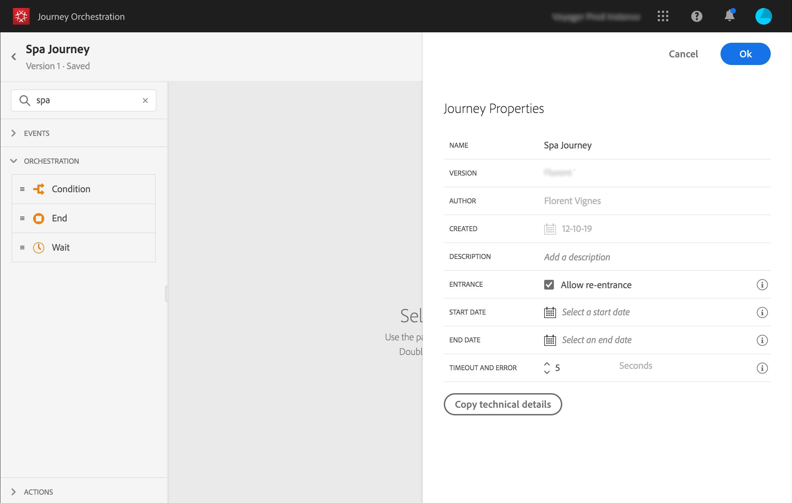
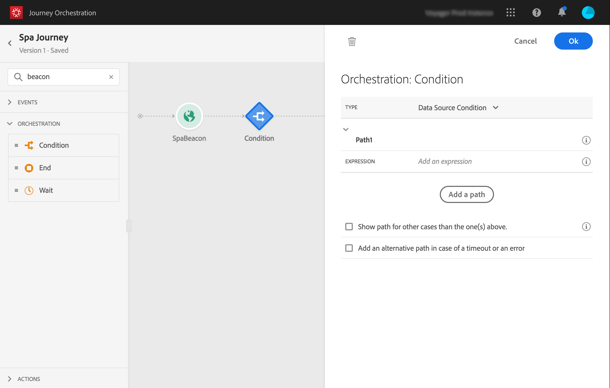
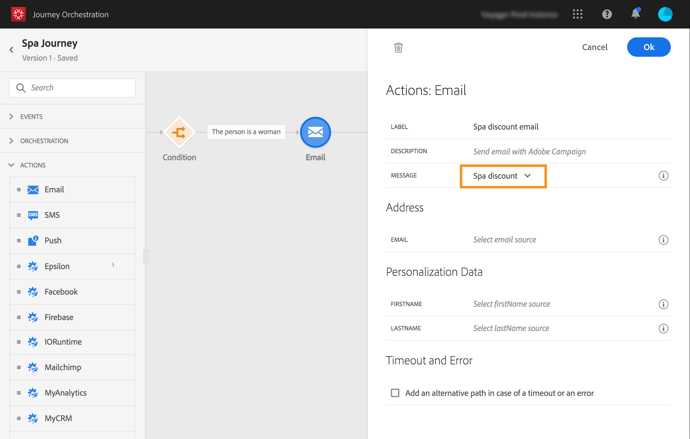
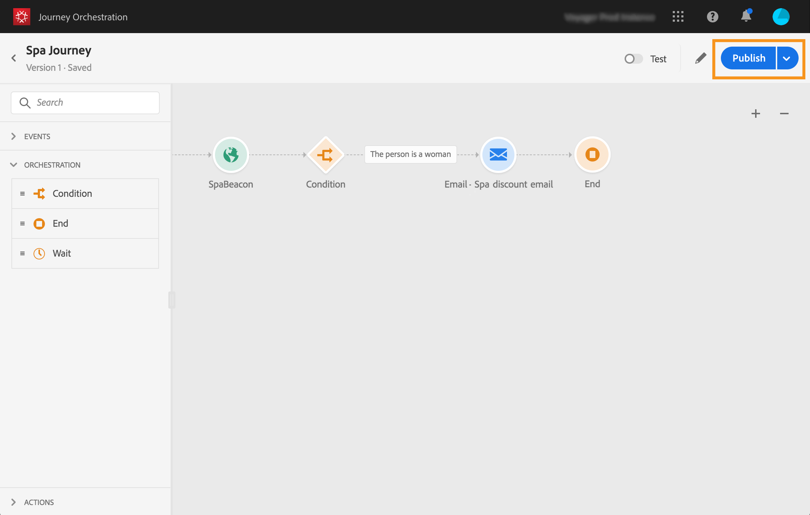

# Building the journey {#concept_eyw_mcy_w2b}

The **business user** can now build the journey. Our journey will only include one path with the following activities:

* the "SpaBeacon" **event**: when a person walks near the spa beacon, the system will receive an event and the journey will start for that person.
* a **Condition** activity to check that the person is a woman
* an **Email** activity (using Adobe Campaign Standard)
* an **End** activity

>[!NOTE]
>
>The **Push** and **Email** activities are only available in the palette if you have Adobe Campaign Standard.

For additional information on how to build a journey, refer to [Building a journey](../building-journeys/journey.md#concept_gq5_sqt_52b).

1. In the top menu, click the **Home** tab and **Create** to create a new journey.

    

1. Edit the journey's properties in the configuration pane displayed on the right side. We name it "Spa journey" and set it to last for one month, from the 1st to the 31st of December.

    

1. Start designing your journey by drag and dropping the "SpaBeacon" event from the palette to the canvas. You can also double-click on the event in the palette to add it to the canvas.

    

1. Let's now add a condition to check that the person is a woman. Drag and drop a condition activity into your journey.

    

1. Choose the **Data Source Condition** type and click in the **Expression** field. You can also define a condition label that will appear on the arrow, in the canvas.

    

1. Using the simple expression editor, look for the gender field (_person > gender_) and drop it to the right to create the following condition: "gender is equal to "Female".

    

1. Drop an **Email** activity and select your "Spa discount" transactional messaging template. This template was designed using Adobe Campaign. Refer to this [page](https://docs.adobe.com/content/help/en/campaign-standard/using/communication-channels/transactional-messaging/about-transactional-messaging.html).

    

1. Click inside the **Email** field and select the email address from the data source.

    

1. In the same way, define the first name and last name personalization fields from the data source.

    

1. Drop an **End** activity.

    

1. Click on the **Test** toggle and test your journey using test profiles. If there is any error, deactivate the test mode, modify your journey and test it again. For more information on the test mode, refer to [Testing your journey](../building-journeys/journeypublication.md#section_ctr_lqk_fhb). 

    

1. When the test is conclusive, you can publish your journey from the top right drop-down menu.

    

Next time a woman walks near the spa beacon, she will immediately receive a "Spa discount" personalized email.
