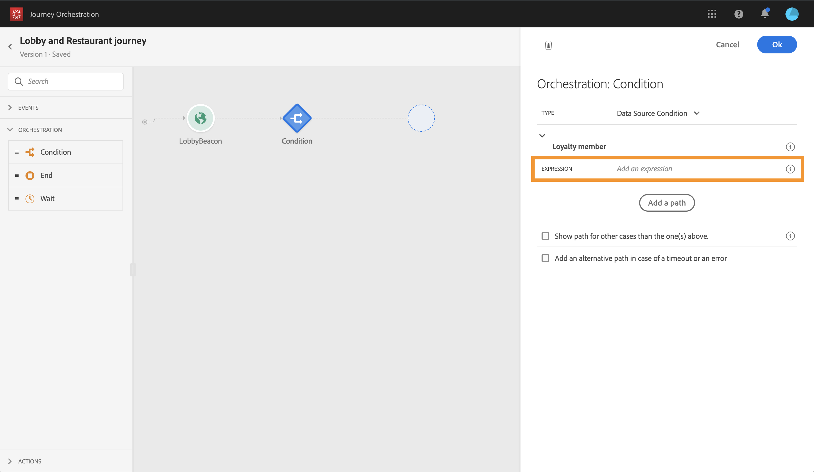
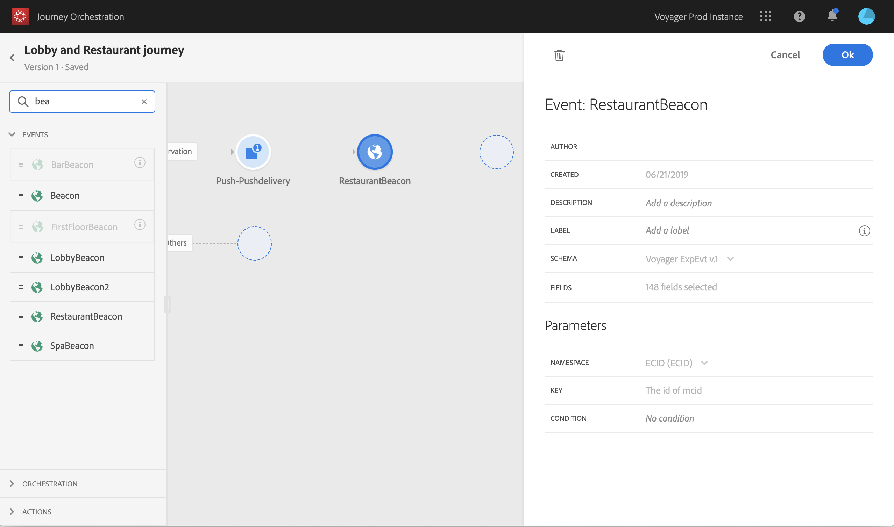
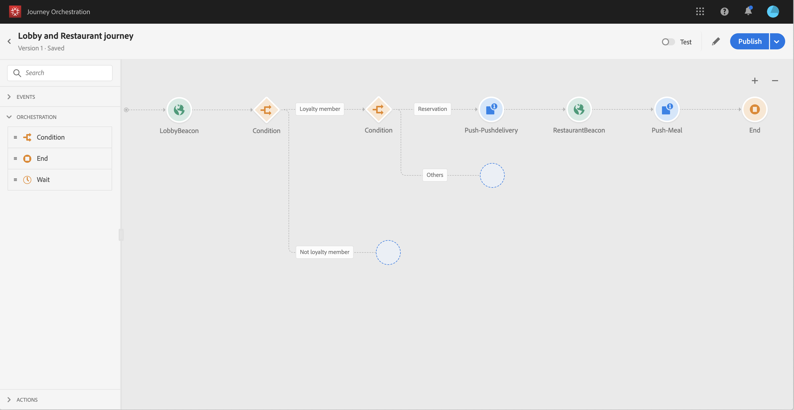

# Building the journey{#concept_owm_kdy_w2b}

The **business user** can now build the journey. Our journey will include the following activities:

* two **Event** activities: "LobbyBeacon" and "RestaurantBeacon"
* two **Condition** activities
* three **Push** activities and one **Email** activity
* a **Wait** activity
* four **End** activities

For additional information on how to build a journey, refer to [Building a journey](../building-journeys/journey.md#concept_gq5_sqt_52b).

## First steps{#section_ntb_ws1_ffb}

1. In the top menu, click the **Home** tab and **Create** to create a new journey.

    

1. Edit the journey's properties in the configuration pane displayed on the right side. Add a name and set it to last for one month, from the 1st to the 31st of December.

    

1. Start designing your journey by drag and dropping the "LobbyBeacon" event from the palette to the canvas. You can also double-click on the event in the palette to add it to the canvas.

    

1. Let's now add a condition to check that the person has not been contacted in the last 24 hours and check if he is a loyalty member. Drag and drop a condition activity into your journey.

    

1. Choose the **Data Source Condition** type and click in the **Expression** field. You can also define a condition label that will appear on the arrow, in the canvas. In our example, we replace "Condition 1" with "Loyalty member".

    

1. Click **Advanced mode** and define the following condition based on the "timestamp" and "directMarketing.sends.value" fields coming from the Experience Platform data source. The syntax of the expression is:

    ```
    count(#{ExperiencePlatformDataSource.MarltonExperience.experienceevent.all(
        currentDataPackField.directMarketing.sends.value > 0 and
        currentDataPackField.timestamp > nowWithDelta(-1, "days")).timestamp}) == 0
    and
        #{ExperiencePlatformDataSource.MarltonProfiles.Profile._customer.marlton.loyaltyMember}
    ```

    

1. Click the **Add a path** button and create a second path for customers who have not been contacted in the last 24 hours and are not a loyalty member. Name the path "Not loyalty member". The syntax of the expression is:

    ```
    count(#{ExperiencePlatformDataSource.MarltonExperience.experienceevent.all(
        currentDataPackField.directMarketing.sends.value > 0 and
        currentDataPackField.timestamp > nowWithDelta(-1, "days").timestamp}) == 0
    and not
        #{ExperiencePlatformDataSource.MarltonProfiles.Profile._customer.marlton.loyaltyMember}
    ```

    >[!NOTE]
    >
    >In the second part of expression, "Profile" is optional.

1. We need to select a namespace. A namespace is preselected based on schema properties. You can keep the one preselected. For more information on namespaces, see [Selecting the namespace](../event/eventnamespace.md#concept_ckb_3qt_52b).

In our use case, we only want to react to those two conditions, so we don't check the box **Show path for other cases than the one(s) above**.

Two paths are created after your condition:

* _Customers who have not been contacted in the last 24 hours and are loyalty members._
* _Customers who have not been contacted in the last 24 hours and are not loyalty members._


## First path: the customer is a loyalty member {#section_otb_ws1_ffb}

1. In the first path, let's add a condition to check if he has a reservation. Drag and drop a condition activity into your journey.

    

1. Choose the **Data Source Condition** type, and define the condition based on the reservation status information retrieved from the reservation system:

    ```
    #{MarltonReservation.MarltonFieldGroup.reservation} == true
    ```

    

1. When you select a field from an external data source, the right part of the screen displays the list of parameters that were defined when configuring the external data source (see [Configuring the data sources](uc2ds.md#concept_vml_hdy_w2b)). This lets you define the values of the parameters that the system will send to the data source before performing the condition. The external system will then return the payload containing the needed fields. In our case, we have defined one field (the reservation status) and one parameter (the key to identify the customer). Click on the parameter name and define the value of the reservation system key, the Experience Cloud ID, in our example:

    ```
    @{LobbyBeacon.endUserIDs._experience.mcid.id}
    ```

    

1. Since we also want to react to customers who do not have a reservation, we need to check the box **Show path for other cases than the one(s) above**.

    

    Two paths are created:

    * _Customers who have booked a room_
    * _Customers who have not booked a room._

    

1. In the first path (room booked), drop a **Push** activity, select your mobile app and your "Welcome" template.

    

1. Define the **Target** fields required by the system to send the push. 

    * **Push platform**: select the platform: **Apple Push Notification Server** (Apple) or **Firebase Cloud Messaging** (Android).
    * **Registration token**: add the following expression (based on the configured event) using the advanced mode:

        ```
        @{LobbyBeacon._experience.campaign.message.profileSnapshot.pushNotificationTokens.first().token}
        ``

1. Define the Push notification personalization fields. In our example: first name and last name.

1. Add a "RestaurantBeacon" event.

    

1. Add a new **Push** activity, select the "Meal discount" template and define the **Address** and **Personalization** fields. Add an **End** activity.

    

1. We want to send a meal discount push notification only if the person enters the restaurant within the next 6 hours after the welcome push. To do this, we need to use a wait activity. Place your cursor on the welcome push activity and click on the "+" symbol. In the new path, add a wait activity and define a duration of 6 hours. The first eligible activity will be chosen. If the restaurant event is received less than 6 hours after the welcome push, the push activity is sent. If no restaurant event is received within the next 6 hours, the wait is chosen. Place an **End** activity after the wait activity.

    

1. In the second path that follows the reservation condition (no room booked), add a **Push** activity and select your "Room rates" template. Add an **End** activity.

    

## Second path: the customer is not a loyalty member{#section_ptb_ws1_ffb}

1. In the second path that follows the first condition (customer is not a loyalty member), add an **Email** activity and select your "Loyalty membership" template.

    

1. In the **Address** field, select the email address from the data source.

    

1. Define the first name and last name personalization fields from the data source.

    

1. Add an **End** activity.

Click on the **Test** toggle and test your journey. If there is any error, deactivate the test mode, modify your journey and test it again. For more information on the test mode, refer to [Testing your journey](../building-journeys/journeypublication.md#section_ctr_lqk_fhb). 


When the test is conclusive, you can publish your journey from the top right drop-down menu.


