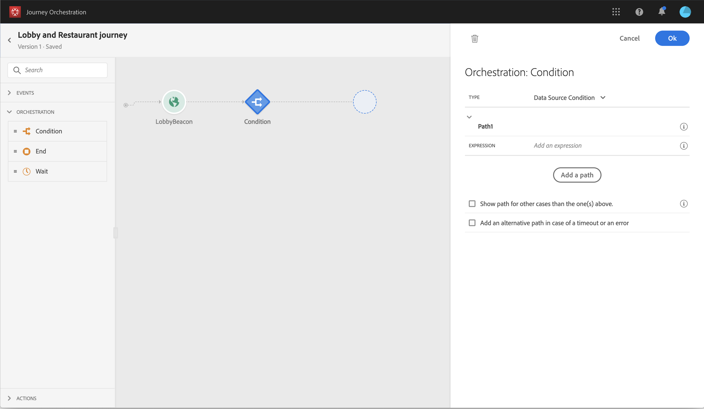
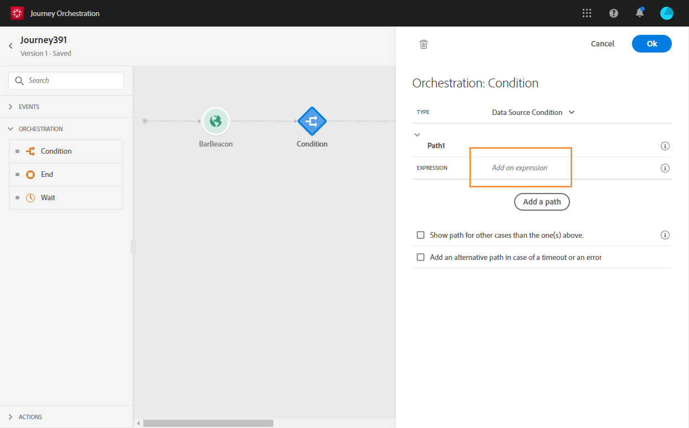

# Leveraging fatigue scores{#concept_dsh_1ry_wfb}

This use case will show you how to leverage fatigue scores to avoid over-soliciting your customers in your journeys.

## Configuring the event {#section_ptb_ws1_ffb}

Follow the steps described in [Configuring an event](event.md#concept_gfj_fqt_52b).

## Configuring the data source {#section_o3n_4yy_wfb}

Perform the following steps to select the fatigue score fields in the built-in data source:

1. In the top bar, click **Data Sources** and select the build-in Experience Platform data source.

    

1. Check that the fields required for your use case are selected.
1. Click **Add a New Field Group**, select the **Profiles** model and add the **fatigueLevel** and **fatigueScore** fields (under _journeyAI > emailScore > fatigue_).

    

1. Click **Save**.

## Building the journey {#section_uzm_pyy_wfb}

To create, validate and publish the journey, follow the steps described in [Building a journey.](../journey/journey.md#concept_gq5_sqt_52b).

In our use case, we're leveraging the **fatigueLevel** field. You can also use the **fatigueScore** field.

Perform the following steps to leverage the fatigue level in your journey:

1. Add an event and a condition in your journey.

    

1. Choose the **Data Source Condition** type and click in the **Expression** field.

    

1. Using the basic expression editor, look for the **fatigueLevel** field (_ExperiencePlatformDataSource > JourneyAIScores > Profile > journeyAI > emailScore > fatigue_), drop it to the right and create the following condition: "fatigueLevel is equal to "Low". Click **Ok**.

    

    >[!NOTE]
    >
    >The advanced expression is: 
    `#{ExperiencePlatformDataSource.JourneyAIScores.Profile.journeyAI.emailScore.fatigue.fatigueLevel} == "low"`

1. In the condition, create two other paths for medium and high fatigue levels.

    

1. You can now add different actions for each fatigue level.

    
